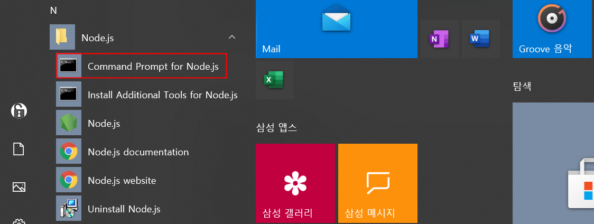
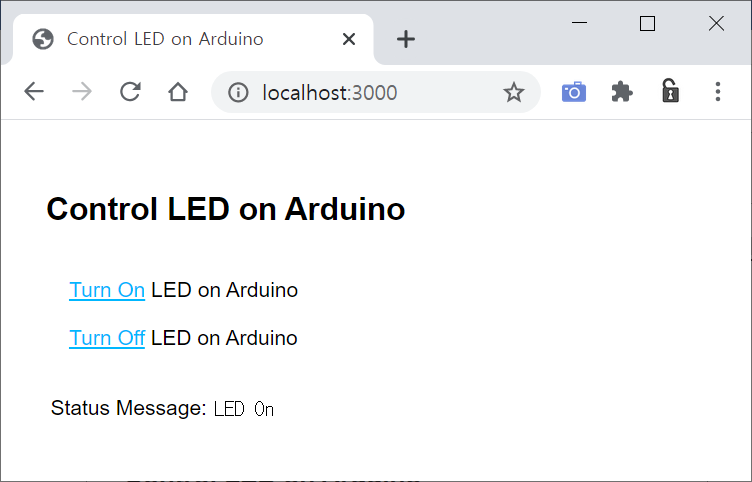
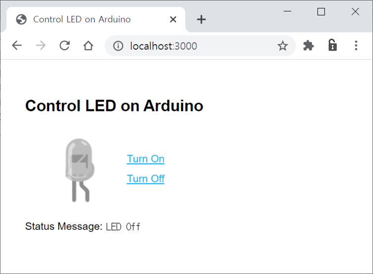
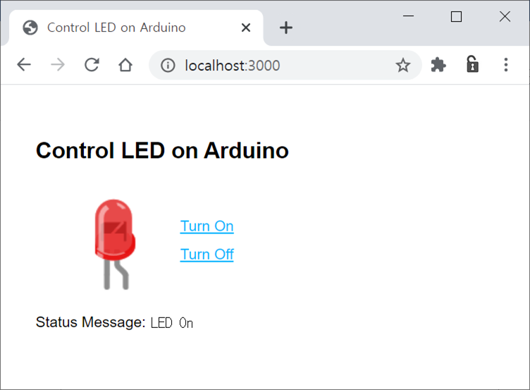
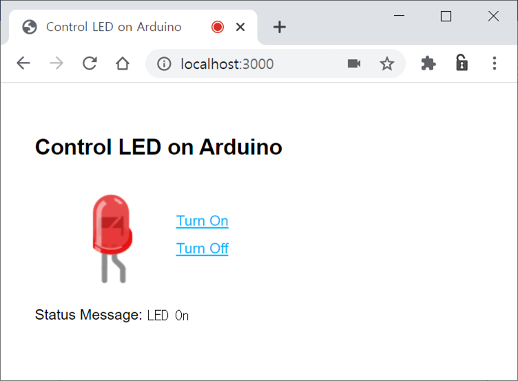

## arduino_web_control
node.js 로 작성한 웹서버를 통해 PC 에 연결된 아두이노 보드의 LED를 제어한다. Node.js 웹서버는 일반 PC 또는 Raspberry Pi 와 같은 SBC( Single Board Computer ) 등을 활용할 수 있다. 

이 후의 내용을 진행하려면 **code4arduino** 폴더의 아두이노 스케치 업로드와  [**Node.js & Express.js**  설치](md/install_nodejs.md)가 선행되어 있어야 한다.

----

#### 웹 어플리케이션 ledUno 작성

**Command Prompt for Node.js**  실행




**Express.js**  프레임워크를 이용해 웹 어플리케이션 **ledUno** 생성

```
C:\Users\user01> express ledUno 
```

기본 의존성 설치

```
C:\Users\user01> cd ledUno 
C:\Users\user01\ledUno> npm install
```

추가 의존성 **serialport** 설치

```
C:\Users\user01\ledUno> npm install serialport --save
```

현재 화면 상단 오른쪽  버튼을 클릭하여 코드를 다운로드 후, 압축 해제하면 2개의 폴더( `code4arduino` ,  `public` )와 `app.js` 파일을 찾을 수 있을 것이다.  

그 중에서 `public` 폴더와 `app.js` 파일을 앞서 **Express.js** 로 만든 웹어플리케이션 **ledUno** 폴더의  `public` 폴더와 `app.js` 파일에 덮어씌운다.

적당한 편집기로 **app.js** 파일을 열어 5번째 행의 **'COM2'** 를 아두이노가 연결된 포트번호로 변경 후 저장한다.

```javascript
var express = require('express');
var app = express();

var SerialPort = require('serialport'); // <-----------
var sp = new SerialPort('COM2', {
  baudRate: 9600
});
```


웹 서버 **Version1** 구동

```
C:\Users\user01\ledUno> copy .\public\html\ver1\*.* .\public
.\public\html\ver1\index.html
.\public\index.html을(를) 덮어쓰시겠습니까? (Yes/No/All): y
        1개 파일이 복사되었습니다.
        
C:\Users\user01\ledUno> node app.js
listening on *:3000 
```

웹브라우저에서 URL: http://localhost:3000/ 을 열어 동작 확인

   


웹 서버 **Version2** 구동

```
C:\Users\user01\ledUno> copy .\public\html\ver2\*.* .\public
.\public\html\ver1\index.html
.\public\index.html을(를) 덮어쓰시겠습니까? (Yes/No/All): y
        1개 파일이 복사되었습니다.
        
C:\Users\user01\ledUno> node app.js
listening on *:3000 
```

웹브라우저에서 URL: http://localhost:3000/ 을 열어 동작 확인

  


웹 서버 **Version3** 구동

```
C:\Users\user01\ledUno> copy .\public\html\ver3\*.* .\public
.\public\html\ver1\index.html
.\public\index.html을(를) 덮어쓰시겠습니까? (Yes/No/All): y
        1개 파일이 복사되었습니다.
        
C:\Users\user01\ledUno> node app.js
listening on *:3000 
```

웹브라우저에서 URL: http://localhost:3000/ 을 열어 동작 확인

  