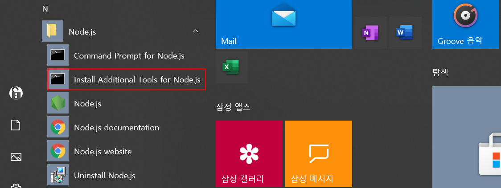

### Node.js 설치

------

##### 1. 설치파일 다운로드

웹 브라우저에서  **URL: http://nodejs.org** 을 열어 **LTS** ( Long Term Supported ) 버전을 선택하여 다운로드한다.

  

##### 2. 설치파일 실행

  

  

현재 **PC** 에 **Python** 과  **Visual Studio & C++** 컴파일러가 이미 설치되어 있다면 오른쪽 아래 그림의 **Tools for Native Module** 설치과정의 체크박스를 선택하지 않는다.  

  

  

##### 3. 설치 확인 및 Express.js 설치

다음 그림과 같이 시작 메뉴의 알파벳 **N** 항목에서 **Node.js** 프로그램 그룹을 찾아  **Command Prompt for Node.js** 를 연다. 


**설치된 node.js 버전 확인.** 

```
C:\Users\user01>  node –v 
v14.15.1
```

**설치된 npm**(Node Package Manager) **버전 확인.** 

```
C:\Users\user01>  npm –v
6.14.8
```

**Express.js 설치**

```
C:\Users\user01>  npm install -g express
```

```
C:\Users\user01>  npm install -g express-generator
```


`npm install`  명령에서 에러가 발생할 경우 

1. 에러 메세지 중에 `Python27` ,  `Python37`  같은 문구가 반복해서 나올경우, [파이썬을 설치](install_python.md)한다.

2. 에러 메세지 중에 `VS2013` 이 나타난 경우, [**Visual Studio** & **C++ 개발도구**](./install_visual_tudio.md) 를 설치한다.

3. 위 1, 2번 항목에 모두 해당할 경우, 아래 그림의 **Install Additional Tools for Node.js** 를 실행한다.

   