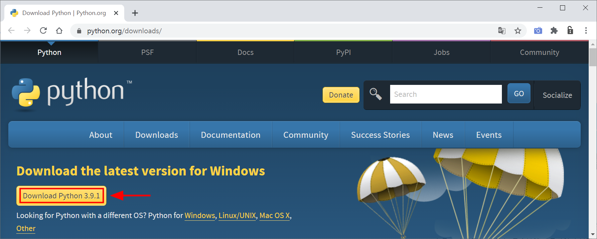

### Python 설치

------

##### 1. 설치파일 다운로드

웹브라우저에서 **URL : http://www.python.org/downloads** 을 연 후, 다음 그림에 표시된 **'Download Python 3.9.1'** 버튼을 클릭하여 설치파일을 다운로드 한다.

##### 2. 설치파일 실행

다운로드한 설치파일( python-3.9.1-amd64.exe )을 관리자 권한으로 실행한다.

아래 그림의 체크박스를 선택해야 파이썬이 설치된 경로가 시스템 환경변수에 등록된다.

  

아래 그림의 **Disable path length limit**( 시스템 환경변수에 등록되는 경로의 길이제한 해제 )을 클릭한 후,  **<u>C</u>lose** 버튼을 클릭한다. 

  

