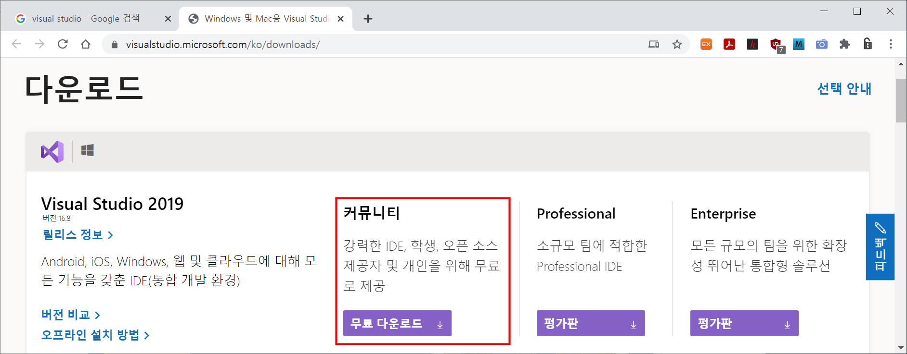
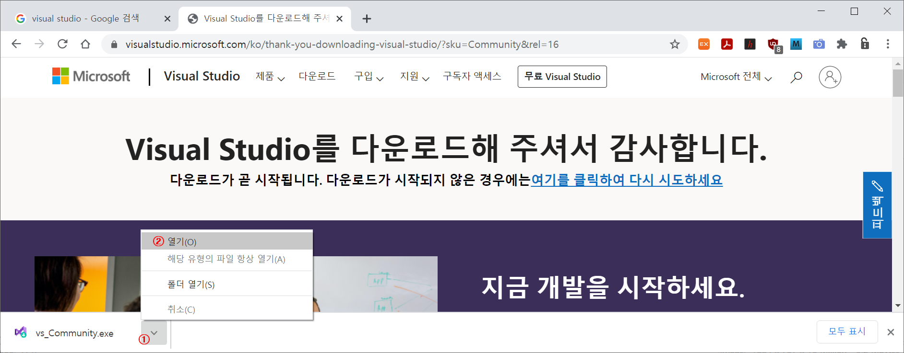
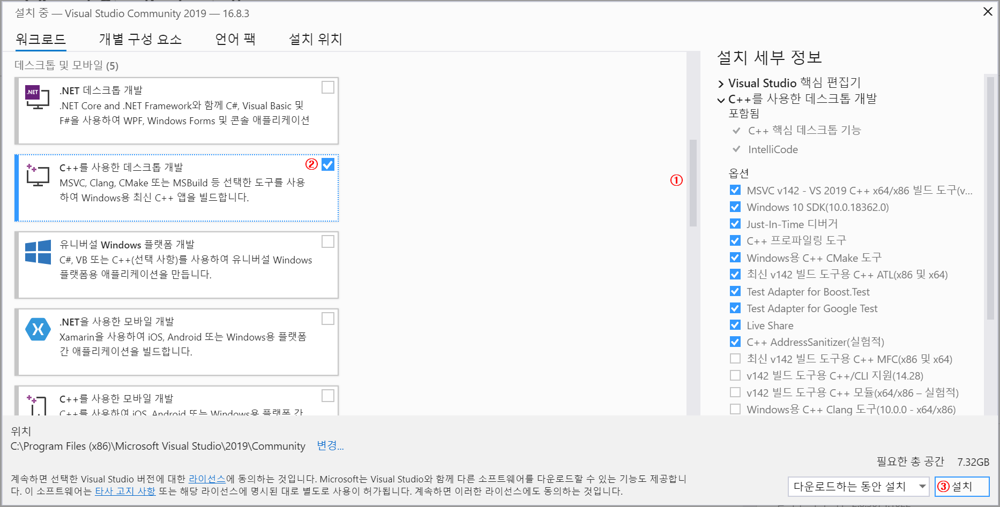
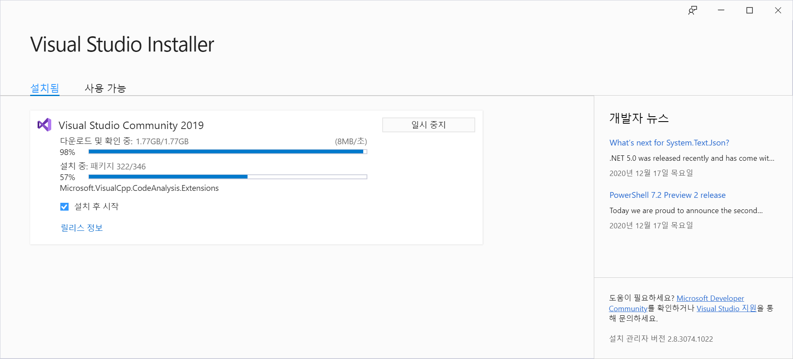
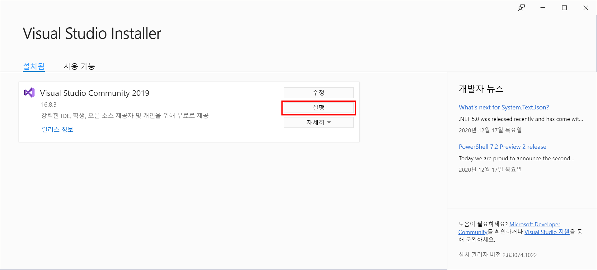
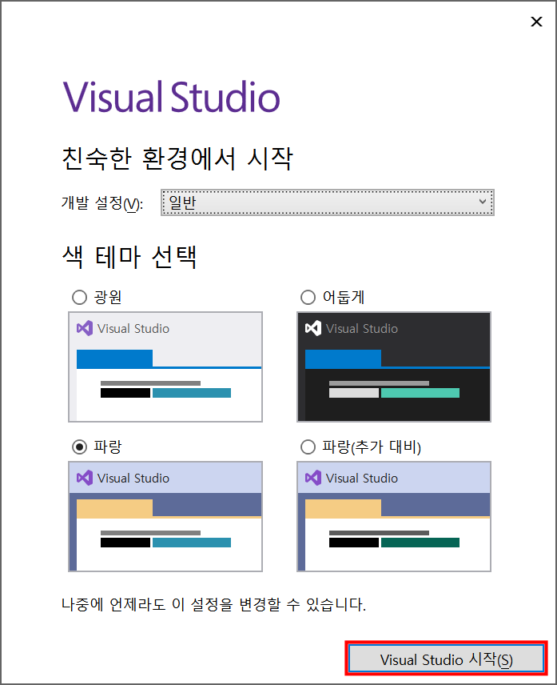

### Visual Studio 설치

------

##### 1. 설치파일 다운로드

웹브라우저에서 **URL : [https://visualstudio.microsoft.com/ko/downloads/](https://visualstudio.microsoft.com/ko/downloads/)** 을 연 후, 다음 그림에 표시된 **'커뮤니티'** 버전의 무료 다운로드 버튼을 클릭하여 설치파일을 다운로드 한다.

##### 2. 설치파일 실행

다음 그림처럼 다운로드한 설치파일( **vs_Community.exe** )을 실행한다.

아래 그림의 **① "C++를 사용한 데스크톱 개발"** 항목이 나타나도록 스크롤다운하여 **②**해당항목을 체크한 후, **③ "설치"** 버튼을 클릭하여 설치를 진행한다. 

설치 진행 상황이 다음과 같이 화면에 표시된다.

설치가 완료되면 다음과 같이 **"실행"** 버튼이 나타난다. 

**"나중에 로그인"**을 클릭한 후, 다음 화면에서 **"색 테마 선택"** 하고 **"Visual Studio 시작(<u>S</u>)"** 버튼을 클릭하여 프로그램을 구동한다. 

